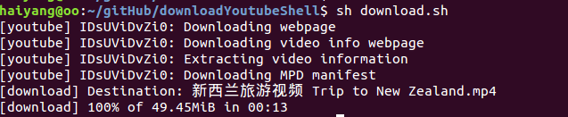
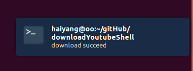

## System Requirement
### Install youtube-dl 

 [https://github.com/rg3/youtube-dl](https://github.com/rg3/youtube-dl)

To install it right away for all UNIX users (Linux, OS X, etc.), type:

    sudo curl -L https://yt-dl.org/downloads/latest/youtube-dl -o /usr/local/bin/youtube-dl
    sudo chmod a+rx /usr/local/bin/youtube-dl

If you do not have curl, you can alternatively use a recent wget:

    sudo wget https://yt-dl.org/downloads/latest/youtube-dl -O /usr/local/bin/youtube-dl
    sudo chmod a+rx /usr/local/bin/youtube-dl

## Copy Youtube Urls
  Open an youtube video which you want to download, copy the url to `url.txt` file. If you want to download mutil vedios,  copy mutil urls to `url.txt`, wrap every url to next line.

## Run shell
  ```
  $ sh download.sh
  ```
  
This will download all your url.txt's vedio to your current folder.
Like this:
  
  

What notification looks like:

  
